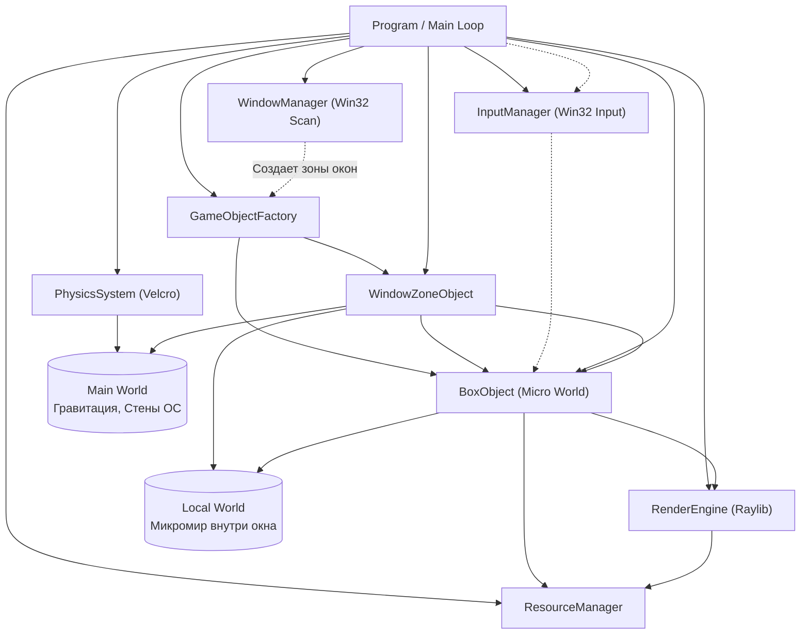

# Архитектура взаимодействия компонентов (C#) тест

```mermaid
flowchart TB
    %% Определение основных компонентов и систем
    Prog["Program / Main Loop"]
    WinMgr["WindowManager (Win32 Scan)"]
    PhysSys["PhysicsSystem (Velcro)"]
    InpMgr["InputManager (Win32 Input)"]
    Render["RenderEngine (Raylib)"]
    ResMgr["ResourceManager"]
    Factory["GameObjectFactory"]

    %% Определение игровых сущностей
    WinZone["WindowZoneObject"]
    BoxObj["BoxObject (Micro World)"]
    
    %% Миры физики
    MainWorld[("Main World\nГравитация, Стены ОС")]
    LocalWorld[("Local World\nМикромир внутри окна")]

    %% Взаимодействия инициализации и управления
    Prog --> Factory
    Prog --> WinMgr
    Prog --> InpMgr
    Prog --> PhysSys
    Prog --> Render
    
    %% Взаимодействие систем и фабрики
    WinMgr -.->|Создает зоны окон| Factory
    Factory --> WinZone
    Factory --> BoxObj
    
    %% Управление ресурсами
    Prog --> ResMgr
    BoxObj --> ResMgr
    Render --> ResMgr

    %% Архитектура физических миров
    PhysSys --> MainWorld
    WinZone --> MainWorld
    
    %% Внутренняя структура WindowZoneObject
    WinZone --> LocalWorld
    WinZone --> BoxObj
    BoxObj --> LocalWorld
    
    %% Взаимодействие ввода и объектов
    InpMgr -.-> BoxObj
    Prog -.-> InpMgr
    Prog --> BoxObj
    
    %% Отрисовка
    Prog --> WinZone
    WinZone --> BoxObj
    BoxObj --> Render

```
